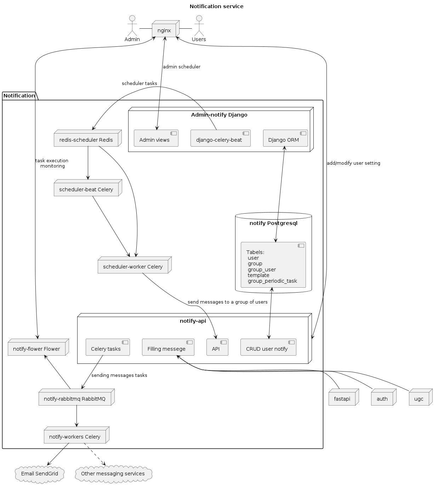

# Проектная работа 10 спринта. Сервис нотификации

Репозиторий с работой [notifications_sprint_1](https://github.com/AlexeyBely/notifications_sprint_1)     

Сервис нотификации состоит из нескольких подсервисов упакованных в отдельные контейнеры:
- ;
- Исследование хранилища mongoDB в каталоге db/research_mongo;

## Состав проекта

- Поднятие кластера mongoDB в каталоге db/mongo;
- Исследование хранилища mongoDB в каталоге db/research_mongo;
- API-cервис (action) для добавления лайков, рецензий, закладкок. Реализован как отдельный сервис.
- Workflow для action github
- Sentry настроено для API-cервиса
- В ELK отправляются логи от сервисов Nginx и action 

### Использованные технологии
   
    
- FastAPI
- MongoDB
- CI Action github
- ELK
- Sentry

### Над проектом работали
- Алексей Белоглазов (тимлид) [@AlexeyBely](https://github.com/AlexeyBely)