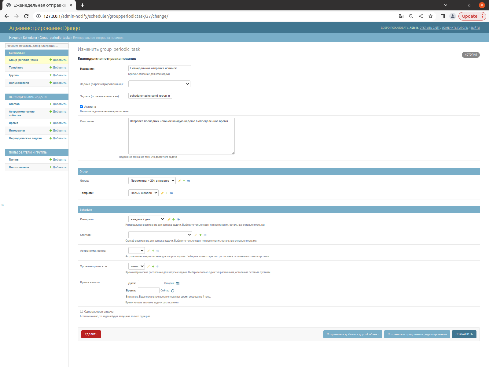

# Проектная работа 10 спринта. Сервис нотификации

Репозиторий с работой [notifications_sprint_1](https://github.com/AlexeyBely/notifications_sprint_1)     

Сервис нотификации состоит из нескольких модулей упакованных в отдельные контейнеры:
- admin-notify - админ-панель для создания, редактирования отложенных задач на отправку сообщений;
- redis-scheduler - боркер сообщений от админ-панели до планировщика(beat) или исполнителя(worker);
- scheduler-beat - планировщик задач для отправки группового задания;
- scheduler-worker - воркер для создания отправки сообщений группе пользователей в notify-api;
- notify-api - сервис для создания задач на отправки каждому пользователю из группового задания.    
    Второй задачей сервиса является создание, редактирование настроек нотификации каждого пользователя;
- notify-rabbitmq - брокер сообщений от notify-api до отправщика (отправщиков) сообщений;
- notify-worker - воркер (отправщик) сообщений пользователю. Можно запускать несколько в зависимости от количества задач; 
- notify-flower - сервис для онлайн просмотра и анализа работы воркеров отправки сообщений;
- notify-psql - база данных для хранения настроек пользоватеоей и отложенных задач; 

## Описание работы сервиса нотификации

Коммуникационная политика в данном сервисе выбрана "at most once" (попытка отправки только один раз). Для анализа неуспешных отправлений и дальнейшей доработки сервиса служит модуль notify-flower.   
База данных сконфигурирована для хранения настроек нотификации каждого пользователя, доступ к созданию/ редактированию
осуществяется через api сервиса notify-api. ID пользователя совпадает с ID зарегистрированном в сервисе авторизации и передаётся через jvt-токен. Предполагается что будет отдельная страничка в веб-браузере с настройками нотификации в личном кабинете пользователя. В админ-панели эти настройки доступны для просмотра.   
Создание задания на отправку сообщений осуществляется через эндпоинт сервиса notify-api, в котором передается имя шаблона и список ID пользователей. Далее в сервисе notify-api считываются переменные со всех сервисов, передаются в виде словаря отправщикам notify-worker для отпраки каждому пользователю. Задачи на отправку передаются через брокер сообщений notify-rabbitmq. Отправщики открывают нужный шаблон, обогащают его передаными переменнами и отправляют разрешенными в настройках способомами (в данном проекте реализован только email).   
Админ-панель admin-notify служит для управления планировщиком рассылок. В каждую рассылку возможно загрузить свой шаблон, выбрать группу пользователей для рассылок. Предполагается что группы пользователей будет создавать отдел аналитики и маркетинга
и загружать непосредственно в базу данных. Создание группы пользователей реализовано в админ-панели, но оно не удобно для создания больших групп т.к. добавление происходит по одному ID пользователя, служит в основном для просмотра и точечного редактирования.  

### Админ-панель admin-notify

Админ-панель доступна по адресу [http://127.0.0.1/admin-notify/]()

Основым являемся сервис SCHEDULER. Вкладки:
 - Templates - создание и загрузка шаблона;
 - Группы - создание/редактирование группы пользователей:
 - Пользователи - настройки нотификации для каждого пользователя. Используется для просмотра и добавления пользователя в группу;
 - group_periodic_task - создание/ редактирование рассылки. Внешний вид настройки рассылки: 
    

     
Технически модель group_periodic_task является надстройкой над моделью "периодическими задачи" сервиса django-celery-beat. В group_periodic_task добавлены выбор шаблона и группы пользователей (если группа не выбрана передается всем пользователям), которые передаются в периодическую задачу django-celery-beat в виде аргументов. При срабатовании переодической рассылки в воркере scheduler-worker проверяется разрешенное время отправки с учетом чассового пояса пользователя. Для пользователей у которых в данный момент рассылка запрещена, создается аналогичная задача на рассылку с отсрочкой. Отсрочка задается в SCHEDULER_DELAY_MIN в .env. Пользователи разрешенные на отправку передаются в сервис notify-api.

### API сервиса нотификации notify-api

Документацию по API можно найти по адресу [http://127.0.0.1/notify/api/openapi]()

### Подготовка и запуск проекта
   

### Использованные технологии   
    
- FastAPI
- Django
- Celery
- RabbitMQ
- Redis

### Над проектом работали
- Алексей Белоглазов [@AlexeyBely](https://github.com/AlexeyBely)